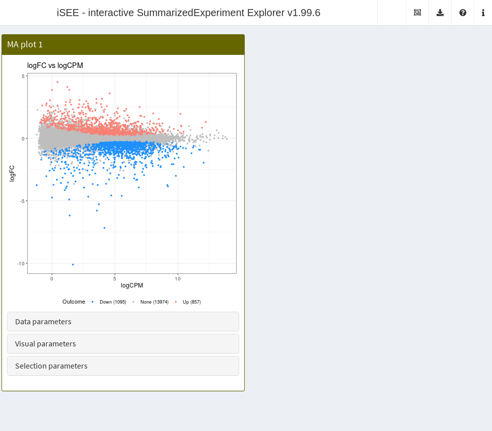
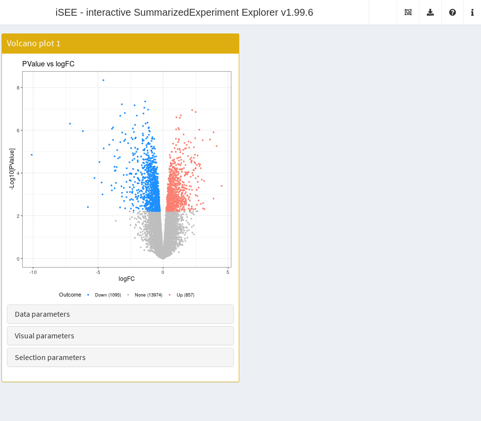
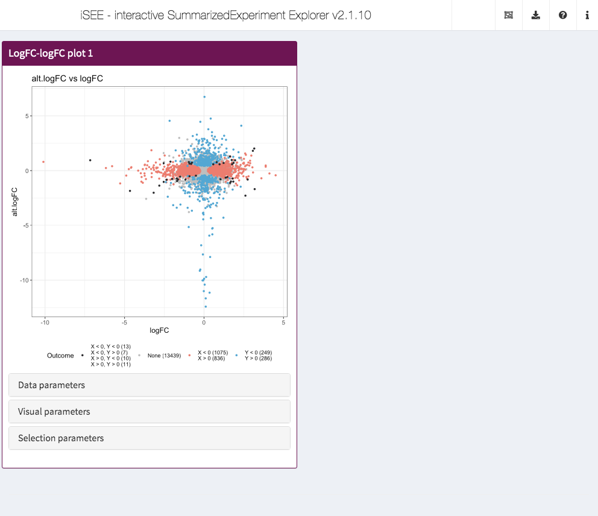
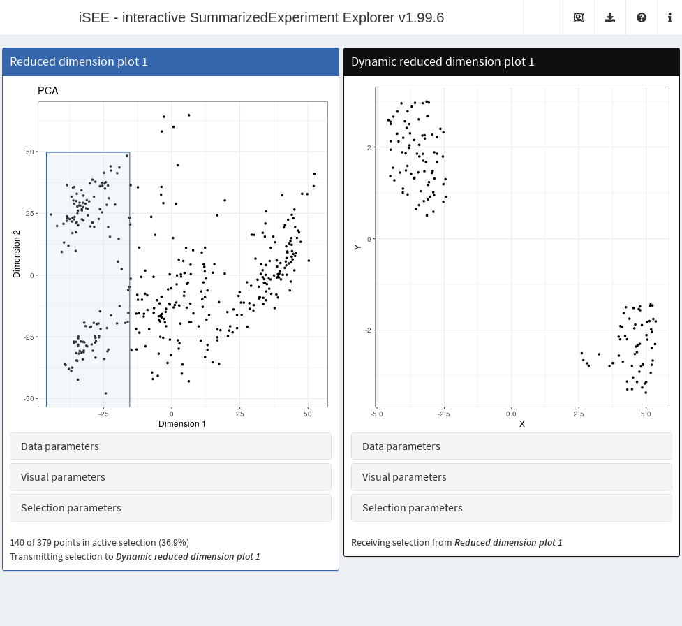
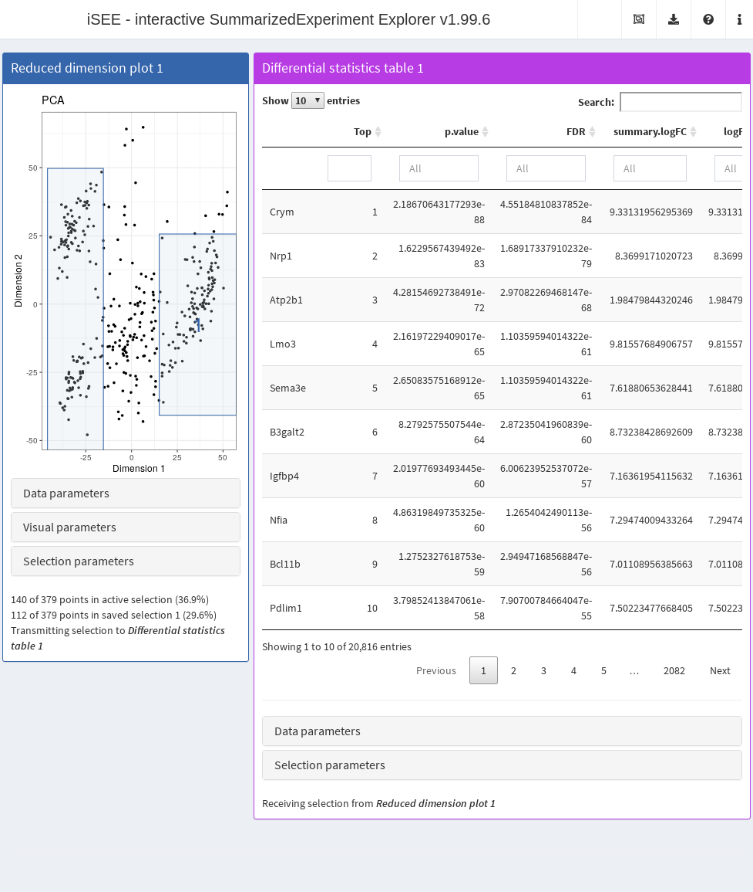
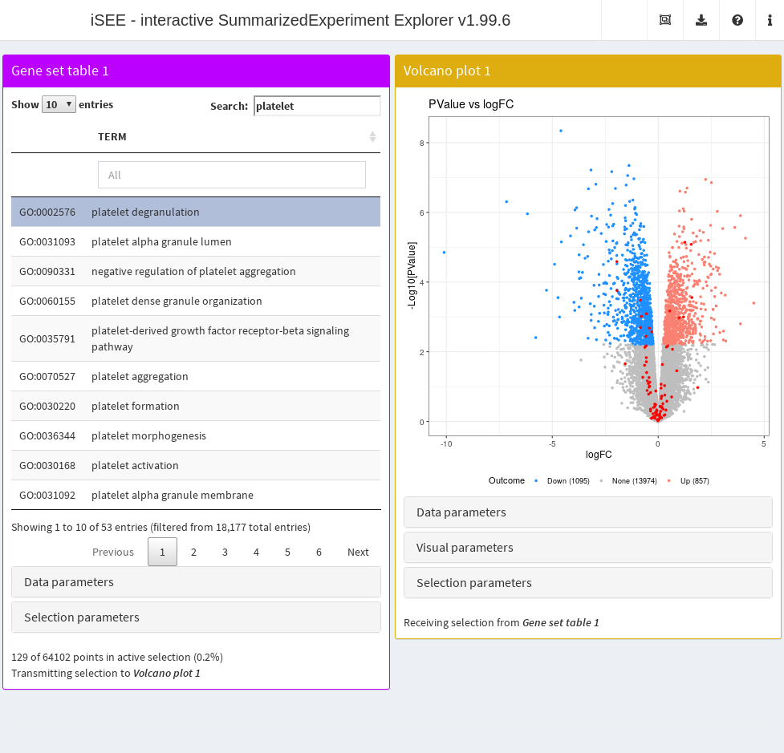
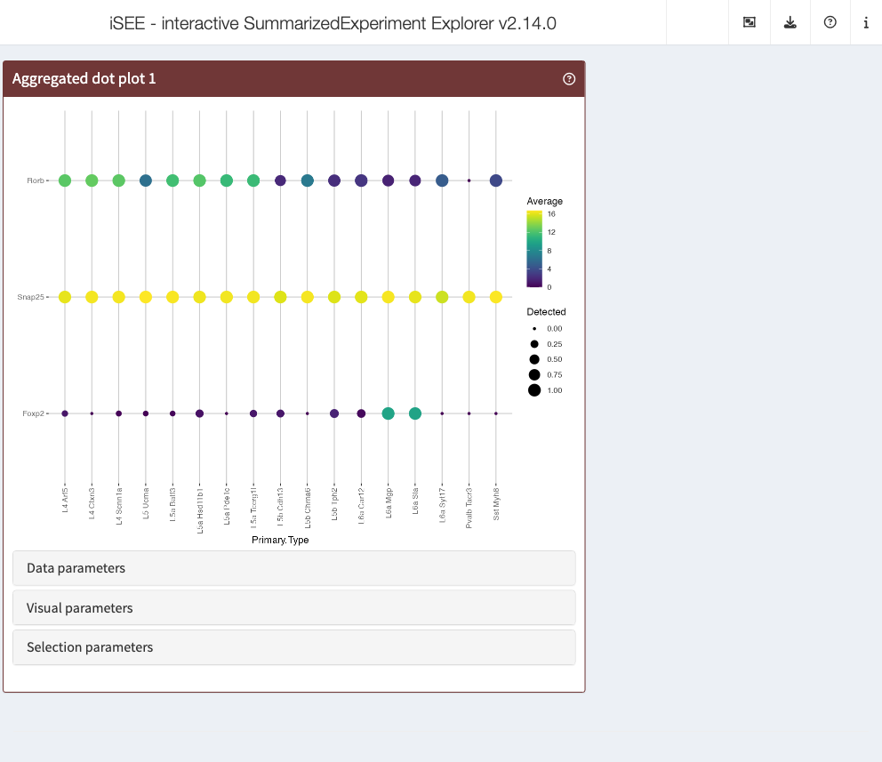
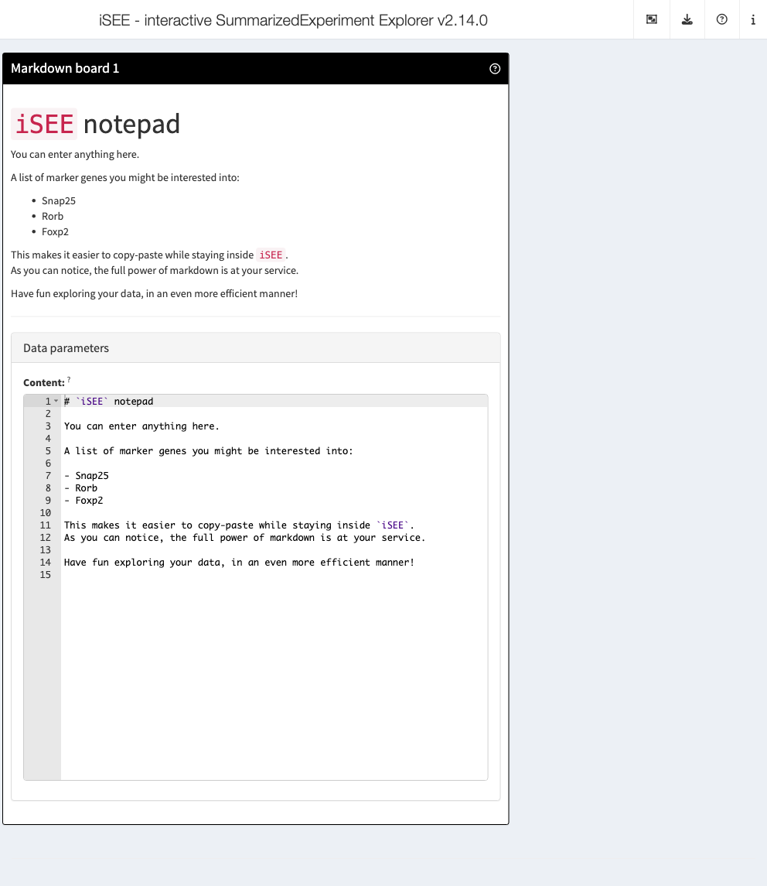

# Universe of iSEE panels

## Overview

The *[iSEE](https://bioconductor.org/packages/3.23/iSEE)* package
(Rue-Albrecht et al. 2018) provides a general and flexible framework for
interactively exploring `SummarizedExperiment` objects. However, in many
cases, more specialized panels are required for effective visualization
of specific data types. The
*[iSEEu](https://bioconductor.org/packages/3.23/iSEEu)* package
implements a collection of such dedicated panel classes that work
directly in the `iSEE` application and can smoothly interact with other
panels. This allows users to quickly parametrize bespoke apps for their
data to address scientific questions of interest. We first load in the
package:

``` r

library(iSEEu)
```

All the panels described in this document can be deployed by simply
passing them into the
[`iSEE()`](https://isee.github.io/iSEE/reference/iSEE.html) function via
the `initial=` argument, as shown in the following examples.

## Differential expression plots

To demonstrate the use of these panels, we will perform a differential
expression analysis on the
*[airway](https://bioconductor.org/packages/3.23/airway)* dataset with
the *[edgeR](https://bioconductor.org/packages/3.23/edgeR)* package. We
store the resulting statistics in the `rowData` of the
`SummarizedExperiment` so that it can be accessed by `iSEE` panels.

``` r

library(airway)
data(airway)

library(edgeR)
y <- DGEList(assay(airway), samples=colData(airway))
y <- y[filterByExpr(y, group=y$samples$dex),]
y <- calcNormFactors(y)

design <- model.matrix(~dex, y$samples)
y <- estimateDisp(y, design)
fit <- glmQLFit(y, design)
res <- glmQLFTest(fit, coef=2)

tab <- topTags(res, n=Inf)$table
rowData(airway) <- cbind(rowData(airway), tab[rownames(airway),])
```

The `MAPlot` class creates a MA plot, i.e., with the log-fold change on
the y-axis and the average expression on the x-axis. Features with
significant differences in each direction are highlighted and counted on
the legend. Users can vary the significance threshold and apply *ad hoc*
filters on the log-fold change. This is a subclass of the `RowDataPlot`
so points can be transmitted to other panels as multiple row selections.
Instances of this class are created like:

``` r

ma.panel <- MAPlot(PanelWidth=6L)
app <- iSEE(airway, initial=list(ma.panel))
```



The `VolcanoPlot` class creates a volcano plot with the log-fold change
on the x-axis and the negative log-p-value on the y-axis. Features with
significant differences in each direction are highlighted and counted on
the legend. Users can vary the significance threshold and apply *ad hoc*
filters on the log-fold change. This is a subclass of the `RowDataPlot`
so points can be transmitted to other panels as multiple row selections.
Instances of this class are created like:

``` r

vol.panel <- VolcanoPlot(PanelWidth=6L)
app <- iSEE(airway, initial=list(vol.panel))
```



The `LogFCLogFCPlot` class creates a scatter plot of two log-fold
changes from different DE comparisons. This allows us to compare DE
results on the same dataset - or even from different datasets, as long
as the row names are shared. Users can vary the significant threshold
used to identify DE genes in either or both comparisons. This is a
subclass of the `RowDataPlot` so points can be transmitted to other
panels as multiple row selections. Instances of this class are created
like:

``` r

# Creating another comparison, this time by blocking on the cell line
design.alt <- model.matrix(~cell + dex, y$samples)
y.alt <- estimateDisp(y, design.alt)
fit.alt <- glmQLFit(y.alt, design.alt)
res.alt <- glmQLFTest(fit.alt, coef=2)

tab.alt <- topTags(res.alt, n=Inf)$table
rowData(airway) <- cbind(rowData(airway), alt=tab.alt[rownames(airway),])

lfc.panel <- LogFCLogFCPlot(PanelWidth=6L, YAxis="alt.logFC", 
    YPValueField="alt.PValue")
app <- iSEE(airway, initial=list(lfc.panel))
```



## Dynamically recalculated panels

To demonstrate, we will perform a quick analysis of a small dataset from
the *[scRNAseq](https://bioconductor.org/packages/3.23/scRNAseq)*
package. This involves computing normalized expression values and
low-dimensional results using the
*[scater](https://bioconductor.org/packages/3.23/scater)* package.

``` r

library(scRNAseq)
sce <- ReprocessedAllenData(assays="tophat_counts")

library(scater)
sce <- logNormCounts(sce, exprs_values="tophat_counts")
sce <- runPCA(sce, ncomponents=4)
sce <- runTSNE(sce)
```

The `DynamicReducedDimensionPlot` class creates a scatter plot with a
dimensionality reduction result, namely principal components analysis
(PCA), $`t`$-stochastic neighbor embedding ($`t`$-SNE) or uniform
manifold and approximate projection (UMAP). It does so dynamically on
the subset of points that are selected in a transmitting panel, allowing
users to focus on finer structure when dealing with a heterogeneous
population. Calculations are performed using relevant functions from the
*[scater](https://bioconductor.org/packages/3.23/scater)* package.

``` r

# Receives a selection from a reduced dimension plot.
dyn.panel <- DynamicReducedDimensionPlot(Type="UMAP", Assay="logcounts",
    ColumnSelectionSource="ReducedDimensionPlot1", PanelWidth=6L)

# NOTE: users do not have to manually create this, just 
# copy it from the "Panel Settings" of an already open app.
red.panel <- ReducedDimensionPlot(PanelId=1L, PanelWidth=6L,
    BrushData = list(
        xmin = -45.943, xmax = -15.399, ymin = -58.560, 
        ymax = 49.701, coords_css = list(xmin = 51.009, 
            xmax = 165.009, ymin = 39.009, 
            ymax = 422.009), coords_img = list(xmin = 66.313, 
            xmax = 214.514, ymin = 50.712, 
            ymax = 548.612), img_css_ratio = list(x = 1.300, 
            y = 1.299), mapping = list(x = "X", y = "Y"), 
        domain = list(left = -49.101, right = 57.228, 
            bottom = -70.389, top = 53.519), 
        range = list(left = 50.986, right = 566.922, 
            bottom = 603.013, top = 33.155), 
        log = list(x = NULL, y = NULL), direction = "xy", 
        brushId = "ReducedDimensionPlot1_Brush", 
        outputId = "ReducedDimensionPlot1"
    )
)

app <- iSEE(sce, initial=list(red.panel, dyn.panel))
```



The `DynamicMarkerTable` class dynamically computes basic differential
statistics comparing assay values across groups of multiple selections
in a transmitting panel. If only the active selection exists in the
transmitting panel, a comparison is performed between the points in that
selection and all unselected points. If saved selections are present,
pairwise comparisons between the active selection and each saved
selection is performed and the results are combined into a single table
using the
[`findMarkers()`](https://rdrr.io/pkg/scran/man/findMarkers.html)
function from *[scran](https://bioconductor.org/packages/3.23/scran)*.

``` r

diff.panel <- DynamicMarkerTable(PanelWidth=8L, Assay="logcounts",
    ColumnSelectionSource="ReducedDimensionPlot1",)

# Recycling the reduced dimension panel above, adding a saved selection to
# compare to the active selection.
red.panel[["SelectionHistory"]] <- list(
    BrushData = list(
        xmin = 15.143, xmax = 57.228, ymin = -40.752, 
        ymax = 25.674, coords_css = list(xmin = 279.009, 
            xmax = 436.089, ymin = 124.009, 
            ymax = 359.009), coords_img = list(xmin = 362.716, 
            xmax = 566.922, ymin = 161.212, 
            ymax = 466.712), img_css_ratio = list(x = 1.300, 
            y = 1.299), mapping = list(x = "X", y = "Y"), 
        domain = list(left = -49.101, right = 57.228, 
            bottom = -70.389, top = 53.519), 
        range = list(left = 50.986, right = 566.922, 
            bottom = 603.013, top = 33.155), 
        log = list(x = NULL, y = NULL), direction = "xy", 
        brushId = "ReducedDimensionPlot1_Brush", 
        outputId = "ReducedDimensionPlot1"
    )
)
red.panel[["PanelWidth"]] <- 4L # To fit onto one line.

app <- iSEE(sce, initial=list(red.panel, diff.panel))
```



## Feature set table

The
[`FeatureSetTable()`](https://isee.github.io/iSEEu/reference/FeatureSetTable-class.md)
class is a bit unusual in that its rows do not correspond to any
dimension of the `SummarizedExperiment`. Rather, each row is a feature
set (e.g., from GO or KEGG) that, upon click, transmits a multiple row
selection to other panels. The multiple selection consists of all rows
in the chosen feature set, allowing users to identify the positions of
all genes in a pathway of interest on, say, a volcano plot. This is also
a rare example of a panel that only transmits and does not receive any
selections from other panels.

``` r

setFeatureSetCommands(createGeneSetCommands(identifier="ENSEMBL"))

gset.tab <- FeatureSetTable(Selected="GO:0002576", 
    Search="platelet", PanelWidth=6L)

# This volcano plot will highlight the genes in the selected gene set.
vol.panel <- VolcanoPlot(RowSelectionSource="FeatureSetTable1",
    ColorBy="Row selection", PanelWidth=6L)

app <- iSEE(airway, initial=list(gset.tab, vol.panel))
```



## App modes

*[iSEEu](https://bioconductor.org/packages/3.23/iSEEu)* contains a
number of “modes” that allow users to conveniently load an `iSEE`
instance in one of several common configurations:

- [`modeEmpty()`](https://isee.github.io/iSEEu/reference/modeEmpty.md)
  will launch an empty app, i.e., with no panels. This is occasionally
  useful to jump to the landing page where a user can then upload a
  `SummarizedExperiment` object.
- [`modeGating()`](https://isee.github.io/iSEEu/reference/modeGating.md)
  will launch an app with multiple feature assay panels that are linked
  to each other. This is useful for applying sequential restrictions on
  the data, equivalent to gating in a flow cytometry experiment.
- [`modeReducedDim()`](https://isee.github.io/iSEEu/reference/modeReducedDim.md)
  will launch an app with multiple reduced dimension plots. This is
  useful for examining different views of large high-dimensional
  datasets (e.g., single-cell studies).

## Miscellaneous panels

*[iSEEu](https://bioconductor.org/packages/3.23/iSEEu)* also includes a
number of other panel types, that one can find useful within different
contexts.

Coupled to each chunk of code listed below, it is possible to display a
screenshot of the app showcasing them.

**AggregatedDotPlot**

``` r

app <- iSEE(
    sce,
    initial = list(
        AggregatedDotPlot(
            ColumnDataLabel="Primary.Type",
            CustomRowsText = "Rorb\nSnap25\nFoxp2",
            PanelHeight = 500L, 
            PanelWidth = 8L
        )  
    )
)

## To be later run as...
# app
## ... or
# shiny::runApp(app)
```



This can be very useful as an alternative to the `ComplexHeatmapPlot`
panel, as sometimes it is not just about the shifts in average
expression levels, but true biological signal can be found e.g. in
scenarios such as differential detection.

**MarkdownBoard**

The `MarkdownBoard` panel class renders Markdown notes, user-supplied,
into HTML to display inside the app.

``` r

app <- iSEE(
    sce, 
    initial = list(
        MarkdownBoard(
            Content = "# `iSEE` notepad\n\nYou can enter anything here.\n\nA list of marker genes you might be interested into:\n\n- Snap25\n- Rorb\n- Foxp2\n\nThis makes it easier to copy-paste while staying inside `iSEE`.  \nAs you can notice, the full power of markdown is at your service.\n\nHave fun exploring your data, in an even more efficient manner!\n", 
            PanelWidth = 8L,
            DataBoxOpen = TRUE
        )
    )
)

## To be later run as...
# app
## ... or
# shiny::runApp(app)
```

This is useful for displaying information alongside other panels, or for
users to simply jot down their own notes (and re-use them more
efficiently later).



The content of the `MarkdownBoard` is included in the `Data parameters`
portion of the panel, as visible in the screenshot.

*[iSEE](https://bioconductor.org/packages/3.23/iSEE)* will take care of
rendering your notes into good-looking yet simple HTML, that can
embedded in a variety of analytic workflows for the data under
inspection.

## Contributing to *[iSEEu](https://bioconductor.org/packages/3.23/iSEEu)*

If you want to contribute to the development of the
*[iSEEu](https://bioconductor.org/packages/3.23/iSEEu)* package, here is
a quick step-by-step guide:

- Fork the `iSEEu` repository from GitHub
  (<https://github.com/iSEE/iSEEu>) and clone it locally.

&nbsp;

    git clone https://github.com/[your_github_username]/iSEEu.git

- Add the desired new files - start from the `R` folder, then document
  via `roxygen2` - and push to your fork. As an example you can check
  out to understand how things are supposed to work, there are several
  modes already defined in the `R/` directory. A typical contribution
  could include e.g. a function defining an
  *[iSEE](https://bioconductor.org/packages/3.23/iSEE)* mode, named
  `modeXXX`, where `XXX` provides a clear representation of the purpose
  of the mode. Please place each mode in a file of its own, with the
  same name as the function. The function should be documented
  (including an example), and any required packages should be added to
  the `DESCRIPTION` file.

- Once your `mode`/function is done, consider adding some information in
  the package. Some examples might be a screenshot of the mode in action
  (to be placed in the folder `inst/modes_img`), and a well-documented
  example use case (maybe an entry in the `vignettes` folder). Also add
  yourself as a contributor (`ctb`) to the `DESCRIPTION` file.

- Make a pull request to the original repo - the GitHub site offers a
  practical framework to do so, enabling comments, code reviews, and
  other goodies. The
  *[iSEE](https://bioconductor.org/packages/3.23/iSEE)* core team will
  evaluate the contribution and get back to you!

That’s pretty much it!

##### Using example data sets

Example data sets can often be obtained from an
*[ExperimentHub](https://bioconductor.org/packages/3.23/ExperimentHub)*
package (e.g. from the
*[scRNAseq](https://bioconductor.org/packages/3.23/scRNAseq)* package
for single-cell RNA-sequencing data), and should not be added to the
*[iSEEu](https://bioconductor.org/packages/3.23/iSEEu)* package.

##### Documenting, testing, coding style and conventions

- If possible, please consider adding an example in the dedicated
  Roxygen preamble to show how to run each function
- If possible, consider adding one or more unit tests - we use the
  `testthat` framework

We do follow some guidelines regarding the names given to variables,
please abide to these for consistency with the rest of the codebase.
Here are a few pointers:

- Keep the indentation as it is in the initial functions already
  available (4-spaces indentation).
- If writing text (e.g. in the vignette), please use one sentence per
  line - this makes `git diff` operations easier to check.
- When choosing variable names, try to keep the consistency with what
  already is existing:
  - `camelCase` for modes and other functions
  - `.function_name` for internals
  - `PanelClassName` for panels
  - `.genericFunction` for the API
  - `.scope1.scope2.name` for variable names in the cached info

If you intend to understand more in depth the internals of the
*[iSEE](https://bioconductor.org/packages/3.23/iSEE)* framework,
consider checking out the bookdown resource we put together at
<https://isee.github.io/iSEE-book/>

##### Looking for constants within *[iSEE](https://bioconductor.org/packages/3.23/iSEE)*

Many of the “global” variables that are used in several places in
*[iSEE](https://bioconductor.org/packages/3.23/iSEE)* are defined in the
[constants.R](https://github.com/iSEE/iSEE/blob/master/R/constants.R)
script in *[iSEE](https://bioconductor.org/packages/3.23/iSEE)*. We
suggest to refer to those constants by their actual value rather than
their internal variable name in downstream panel code. Both constant
variable names and values may change at any time, but we will only
announce changes to the constant value.

##### What if I need a custom panel type?

In addition to the eight standard panel types, custom panels are easily
accommodated within
*[iSEE](https://bioconductor.org/packages/3.23/iSEE)* applications. For
a guide, see the corresponding
[vignette](https://bioconductor.org/packages/release/bioc/vignettes/iSEE/inst/doc/custom.html).
For examples, see [this repo](https://github.com/iSEE/iSEE_custom).

##### Where can I find a comprehensive introduction to *[iSEE](https://bioconductor.org/packages/3.23/iSEE)*?

The *[iSEE](https://bioconductor.org/packages/3.23/iSEE)* package
contains several vignettes detailing the main functionality. You can
also take a look at this
[workshop](https://iSEE.github.io/iSEEWorkshop2019/index.html). A
compiled version from the Bioc2019 conference (based on Bioconductor
release 3.10) is available
[here](http://biocworkshops2019.bioconductor.org.s3-website-us-east-1.amazonaws.com/page/iSEEWorkshop2019__iSEE-lab/).

## Session information

``` r

sessionInfo()
```

    ## R Under development (unstable) (2025-11-30 r89082)
    ## Platform: x86_64-pc-linux-gnu
    ## Running under: Ubuntu 24.04.3 LTS
    ## 
    ## Matrix products: default
    ## BLAS:   /usr/lib/x86_64-linux-gnu/openblas-pthread/libblas.so.3 
    ## LAPACK: /usr/lib/x86_64-linux-gnu/openblas-pthread/libopenblasp-r0.3.26.so;  LAPACK version 3.12.0
    ## 
    ## locale:
    ##  [1] LC_CTYPE=en_US.UTF-8       LC_NUMERIC=C              
    ##  [3] LC_TIME=en_US.UTF-8        LC_COLLATE=en_US.UTF-8    
    ##  [5] LC_MONETARY=en_US.UTF-8    LC_MESSAGES=en_US.UTF-8   
    ##  [7] LC_PAPER=en_US.UTF-8       LC_NAME=C                 
    ##  [9] LC_ADDRESS=C               LC_TELEPHONE=C            
    ## [11] LC_MEASUREMENT=en_US.UTF-8 LC_IDENTIFICATION=C       
    ## 
    ## time zone: UTC
    ## tzcode source: system (glibc)
    ## 
    ## attached base packages:
    ## [1] stats4    stats     graphics  grDevices utils     datasets  methods  
    ## [8] base     
    ## 
    ## other attached packages:
    ##  [1] scater_1.39.0               ggplot2_4.0.1              
    ##  [3] scuttle_1.21.0              scRNAseq_2.25.0            
    ##  [5] edgeR_4.9.0                 limma_3.67.0               
    ##  [7] airway_1.31.0               iSEEu_1.23.0               
    ##  [9] iSEEhex_1.13.0              iSEE_2.23.1                
    ## [11] SingleCellExperiment_1.33.0 SummarizedExperiment_1.41.0
    ## [13] Biobase_2.71.0              GenomicRanges_1.63.0       
    ## [15] Seqinfo_1.1.0               IRanges_2.45.0             
    ## [17] S4Vectors_0.49.0            BiocGenerics_0.57.0        
    ## [19] generics_0.1.4              MatrixGenerics_1.23.0      
    ## [21] matrixStats_1.5.0           BiocStyle_2.39.0           
    ## 
    ## loaded via a namespace (and not attached):
    ##   [1] splines_4.6.0            later_1.4.4              BiocIO_1.21.0           
    ##   [4] bitops_1.0-9             filelock_1.0.3           tibble_3.3.0            
    ##   [7] XML_3.99-0.20            lifecycle_1.0.4          httr2_1.2.1             
    ##  [10] doParallel_1.0.17        lattice_0.22-7           ensembldb_2.35.0        
    ##  [13] alabaster.base_1.11.1    magrittr_2.0.4           sass_0.4.10             
    ##  [16] rmarkdown_2.30           jquerylib_0.1.4          yaml_2.3.11             
    ##  [19] httpuv_1.6.16            otel_0.2.0               DBI_1.2.3               
    ##  [22] RColorBrewer_1.1-3       abind_1.4-8              Rtsne_0.17              
    ##  [25] AnnotationFilter_1.35.0  RCurl_1.98-1.17          rappdirs_0.3.3          
    ##  [28] circlize_0.4.16          ggrepel_0.9.6            irlba_2.3.5.1           
    ##  [31] alabaster.sce_1.11.0     pkgdown_2.2.0.9000       codetools_0.2-20        
    ##  [34] DelayedArray_0.37.0      DT_0.34.0                tidyselect_1.2.1        
    ##  [37] shape_1.4.6.1            UCSC.utils_1.7.0         farver_2.1.2            
    ##  [40] viridis_0.6.5            ScaledMatrix_1.19.0      shinyWidgets_0.9.0      
    ##  [43] BiocFileCache_3.1.0      GenomicAlignments_1.47.0 jsonlite_2.0.0          
    ##  [46] BiocNeighbors_2.5.0      GetoptLong_1.1.0         iterators_1.0.14        
    ##  [49] systemfonts_1.3.1        foreach_1.5.2            tools_4.6.0             
    ##  [52] ragg_1.5.0               Rcpp_1.1.0               glue_1.8.0              
    ##  [55] gridExtra_2.3            SparseArray_1.11.6       xfun_0.54               
    ##  [58] mgcv_1.9-4               GenomeInfoDb_1.47.1      dplyr_1.1.4             
    ##  [61] HDF5Array_1.39.0         gypsum_1.7.0             withr_3.0.2             
    ##  [64] shinydashboard_0.7.3     BiocManager_1.30.27      fastmap_1.2.0           
    ##  [67] rhdf5filters_1.23.1      shinyjs_2.1.0            rsvd_1.0.5              
    ##  [70] digest_0.6.39            R6_2.6.1                 mime_0.13               
    ##  [73] textshaping_1.0.4        colorspace_2.1-2         listviewer_4.0.0        
    ##  [76] RSQLite_2.4.5            cigarillo_1.1.0          h5mread_1.3.1           
    ##  [79] hexbin_1.28.5            rtracklayer_1.71.0       httr_1.4.7              
    ##  [82] htmlwidgets_1.6.4        S4Arrays_1.11.1          pkgconfig_2.0.3         
    ##  [85] gtable_0.3.6             blob_1.2.4               ComplexHeatmap_2.27.0   
    ##  [88] S7_0.2.1                 XVector_0.51.0           htmltools_0.5.8.1       
    ##  [91] bookdown_0.45            ProtGenerics_1.43.0      rintrojs_0.3.4          
    ##  [94] clue_0.3-66              scales_1.4.0             alabaster.matrix_1.11.0 
    ##  [97] png_0.1-8                knitr_1.50               rjson_0.2.23            
    ## [100] nlme_3.1-168             curl_7.0.0               shinyAce_0.4.4          
    ## [103] cachem_1.1.0             rhdf5_2.55.11            GlobalOptions_0.1.3     
    ## [106] BiocVersion_3.23.1       parallel_4.6.0           miniUI_0.1.2            
    ## [109] vipor_0.4.7              AnnotationDbi_1.73.0     restfulr_0.0.16         
    ## [112] desc_1.4.3               pillar_1.11.1            grid_4.6.0              
    ## [115] alabaster.schemas_1.11.0 vctrs_0.6.5              promises_1.5.0          
    ## [118] BiocSingular_1.27.1      dbplyr_2.5.1             beachmat_2.27.0         
    ## [121] xtable_1.8-4             cluster_2.1.8.1          beeswarm_0.4.0          
    ## [124] evaluate_1.0.5           GenomicFeatures_1.63.1   cli_3.6.5               
    ## [127] locfit_1.5-9.12          compiler_4.6.0           Rsamtools_2.27.0        
    ## [130] rlang_1.1.6              crayon_1.5.3             ggbeeswarm_0.7.3        
    ## [133] fs_1.6.6                 viridisLite_0.4.2        alabaster.se_1.11.0     
    ## [136] BiocParallel_1.45.0      Biostrings_2.79.2        lazyeval_0.2.2          
    ## [139] colourpicker_1.3.0       Matrix_1.7-4             ExperimentHub_3.1.0     
    ## [142] bit64_4.6.0-1            Rhdf5lib_1.33.0          KEGGREST_1.51.1         
    ## [145] statmod_1.5.1            shiny_1.11.1             alabaster.ranges_1.11.0 
    ## [148] AnnotationHub_4.1.0      fontawesome_0.5.3        igraph_2.2.1            
    ## [151] memoise_2.0.1            bslib_0.9.0              bit_4.6.0

## References

Rue-Albrecht, Kevin, Federico Marini, Charlotte Soneson, and Aaron T. L.
Lun. 2018. “iSEE: Interactive SummarizedExperiment Explorer.”
*F1000Research* 7 (June): 741.
<https://doi.org/10.12688/f1000research.14966.1>.
